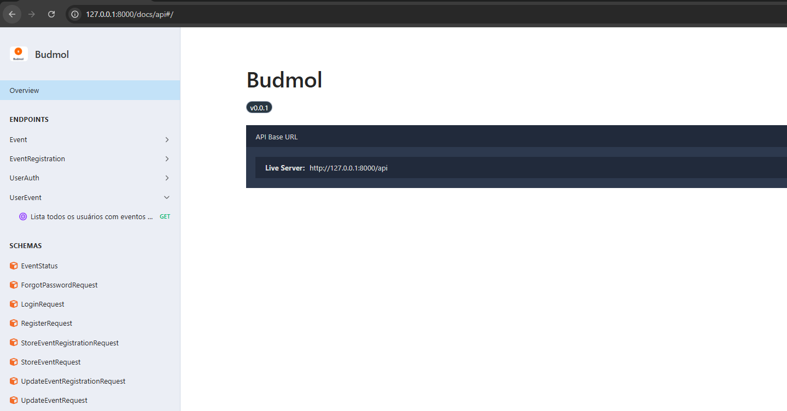
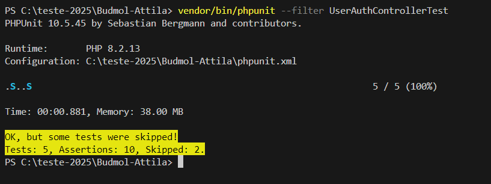
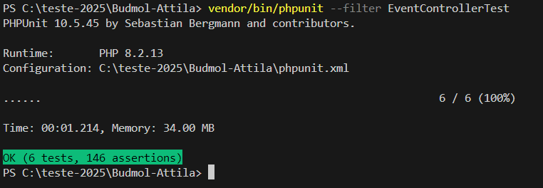
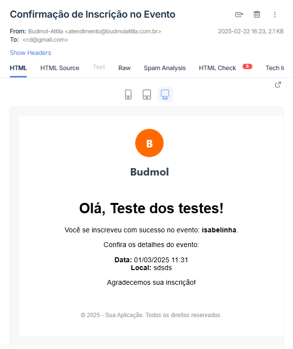
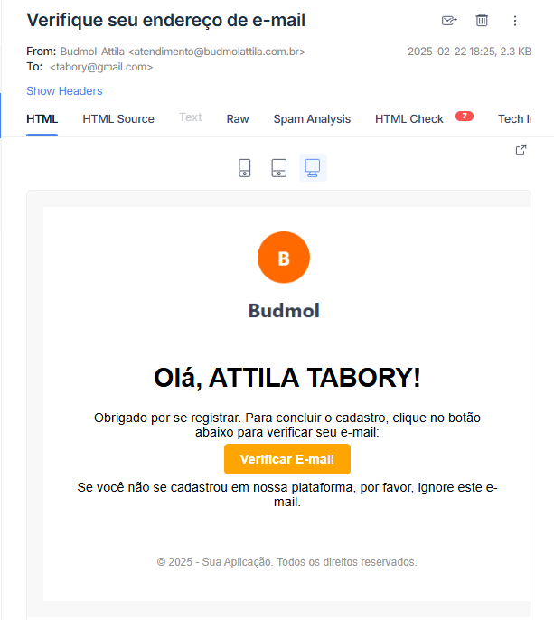
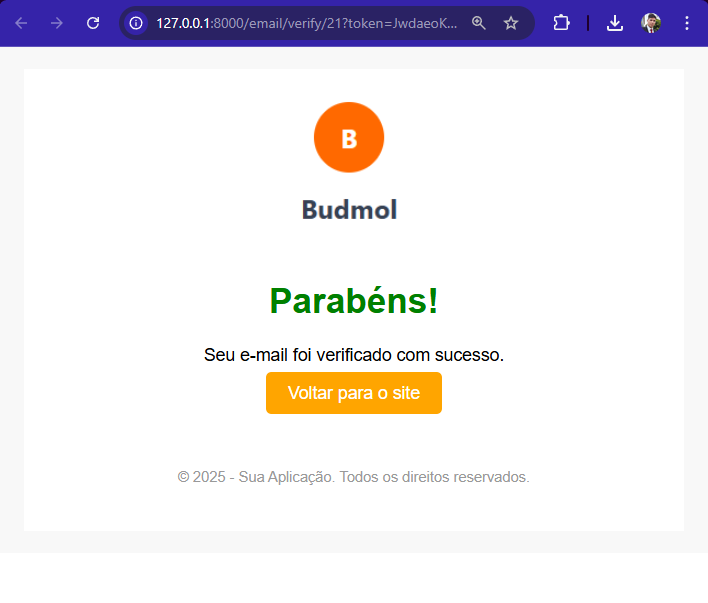
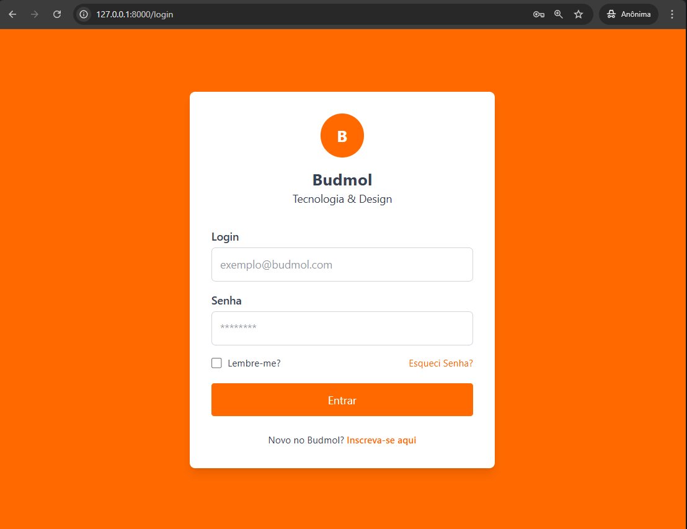
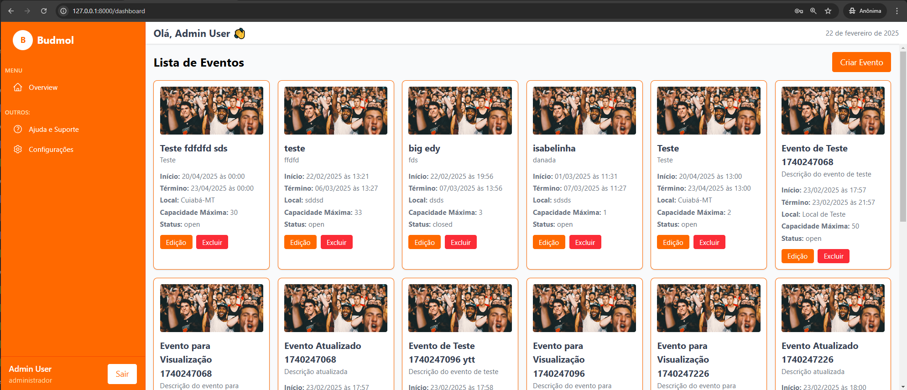

### Hi there, My name is ATTILA  SAMUELL TABORY, I love technology 👋

[](https://www.linkedin.com/in/attila-samuell-98291216b/)
[](https://www.youtube.com/channel/UCuX9fZZa3eR4LACYTPVZg5A/videos)
[](https://play.google.com/store/apps/details?id=attila.QRCodeGeradorLeitor)


# SPA e API BUDMOL.

Esta é a SPA e API BUDMOL, desenvolvida por **Attila Samuell Nunes Tabory** com **PHP 8.1.2** e **Laravel 10**. Este projeto fornece endpoints para criação, gerencialmento,inscrição de eventos e autenticação de usuários. Ele utiliza uma arquitetura limpa, separando responsabilidades em controladores, solicitações, recursos, serviços e repositórios.

### Tecnologias e Ferramentas Utilizadas
- **Back-end**: PHP 8.1.2, Laravel 10
- **Autenticação**: Laravel Sanctum para autenticação baseada em tokens
- **Front End**: React JS com Typescript,Redux,Tailwind CSS.

### Requisitos
- **Composer e PHP**
- **Servidor de desenvolvimento**: Xampp ou Wampp
- **node**: Node

## Arquitetura e Organização do Projeto

### Estrutura de Diretórios
- **app/Http/Controllers**: Contém os controladores principais, como `UserAuthController`, que lidam com autenticação e manipulação de produtos, respectivamente.
- **app/Http/Requests**: Inclui as classes de validação para as requisições de API, garantindo que os dados fornecidos pelos usuários sejam válidos antes de serem processados. Exemplo de requests: `LoginRequest`.
- **app/Http/Resources**: Define os recursos para formatar as respostas de API, como  `UserResource`.
- **app/Repositories**: Implementa a lógica de acesso aos dados, como , que realiza operações específicas de persistência de dados.
- **app/Services**: Camada de serviço que abstrai a lógica de negócios, incluindo `UserAuthService` para autenticação e  para funcionalidades relacionadas ao produto.

### Padrões de Design Utilizados
- **Repository Pattern**: Utilizado para abstrair a lógica de acesso aos dados. Por exemplo, o  é responsável pela comunicação com o banco de dados para operações relacionadas aos produtos, mantendo o código da aplicação desacoplado da lógica de persistência de dados.
- **Service Pattern**: Utilizado para encapsular a lógica de negócios em classes de serviço, como `UserAuthService`. Esses serviços centralizam as operações complexas, tornando o código mais organizado e testável.
- **Dependency Injection**: Utilizado para injetar dependências (por exemplo, `UserAuthService` ) nas classes através do contêiner de serviços do Laravel, promovendo o baixo acoplamento e facilitando a manutenção.
- **Singleton Pattern**: Aplicado na classe `UserAuthService`, garantindo que exista apenas uma instância desse serviço em todo o ciclo de vida da aplicação.
- **Controller-Service-Repository Pattern**: Esse padrão ajuda a manter a separação de responsabilidades ao longo da aplicação. O controlador recebe a solicitação, o serviço processa a lógica de negócios e o repositório lida com o acesso aos dados.

### Principais Endpoints

### Configuração Inicial Do Back End
Para instalar o projeto, siga os passos abaixo:

1. **Clonar o repositório** e criar o arquivo `.env`:
```bash
   cp .env.example .env
```

2. **Instalar as dependências**:
```bash
   composer install
```

3. **Gerar a chave de aplicação**:
```bash
   php artisan key:generate
```

4. **Executar as migrações**:
Lembre-se de criar database em algum client Mysql.
```bash
php artisan migrate
```
5. **Subir Servidor localmente**:
```bash
php artisan serve
```
### Documentação da API
Para documentação da API, o projeto utiliza **Scramble**, uma ferramenta que gera automaticamente documentação detalhada dos endpoints. A documentação é gerada a partir dos comentários e tipos de retorno definidos nos controladores e está disponível para consulta no ambiente local. Isso permite que desenvolvedores tenham uma visão clara dos endpoints disponíveis e suas respectivas requisições e respostas. Para acessar a documentação 'url/docs/api'



Para EXPORTAR documentação, utilize o comando:
```bash
php artisan scramble:export
```
### Configuração Inicial Do FRONT END

Para instalar as dependencias :
```bash
npm install
```

Para rodar a aplicação front end :
```bash
npm run dev
```

### Cobertura Dos Testes
Os testes utilizados são considerados Feature Tests no Laravel, que na prática são testes de integração, pois eles simulam requisições HTTP aos endpoints da sua aplicação, envolvem a autenticação, interagem com o banco de dados e testam a integração entre diferentes camadas da aplicação.
```bash
vendor/bin/phpunit --filter EventControllerTest
```
```bash
vendor/bin/phpunit --filter UserAuthControllerTest
```



### Email notificação de inscrição evento


### Email de verificação do email




### Breve demonstração do sistema de eventos



